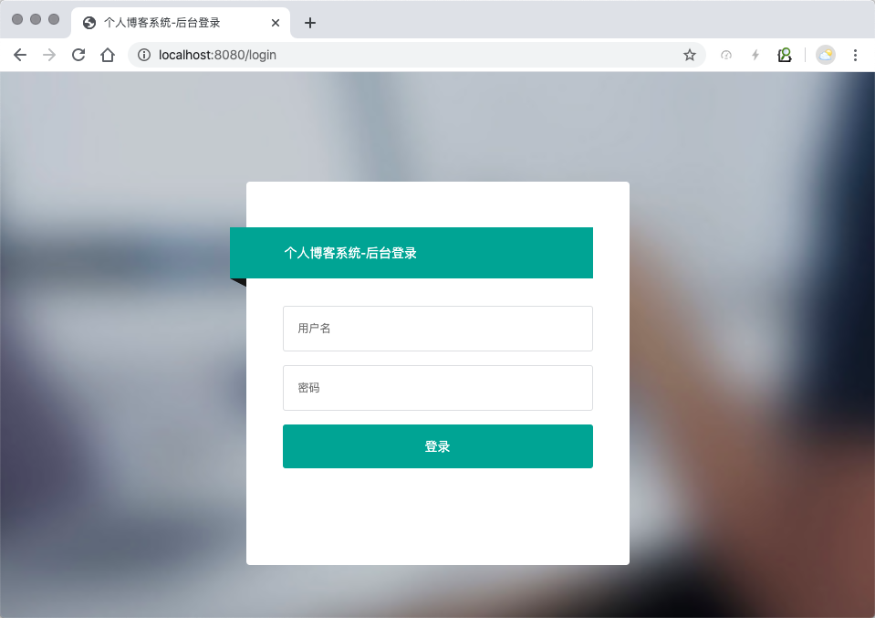
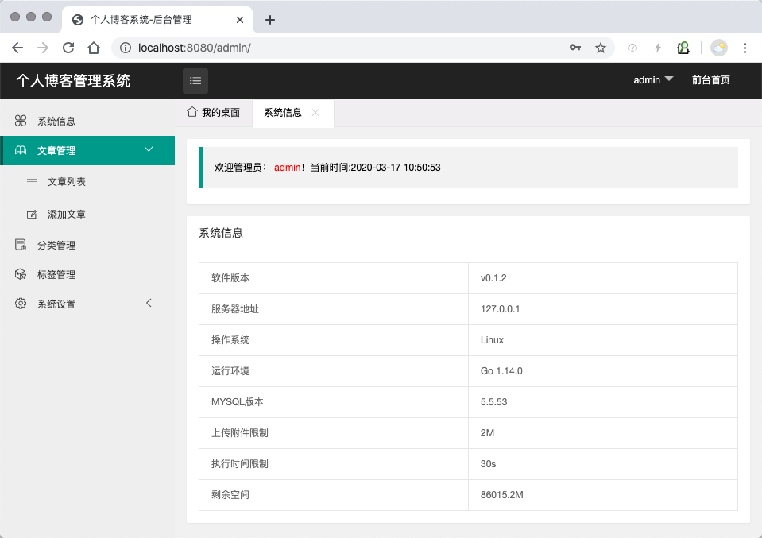

# hblog个人博客系统

[](https://travis-ci.com/github/hzde0128/hblog)

Go语言开发的个人博客系统，基于Beego框架开发。

## 开发计划

- [ ] 后台模块
  - [x] 登录
  - [x] Cookie,Session验证
  - [x] 分类管理
  - [x] 标签管理
  - [x] 文章管理
  - [ ] Redis缓存
  - [ ] 系统设置
  - [x] 数据模型
  - [x] 基本路由设定
  - [x] 修改密码

- [ ] 前台模块
  - [x] 界面展示
  - [ ] 分页处理
  - [ ] 文章详情页

## hblog截图




## 安装

```bash
go get github.com/hzde0128/hblog
cd $GOPATH/github.com/hzde0128/hblog
go run main.go
```

## 登录

[http://127.0.0.1:8080/login](http://127.0.0.1:8080/login)

用户名: `admin`  
密码: `admin888`

用户登录后可自行修改密码
